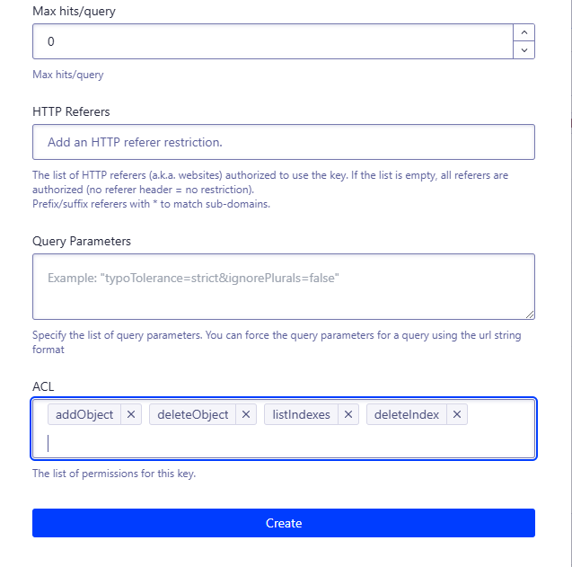

# hexo-algolia [![Build Status][]][pkg-build] ![][pkg-downloads] ![][pkg-version]

> Index content of your [hexo][] website in [Algolia][] and add search within minutes.

`hexo-algolia` is an [hexo][] plugin provided by the community.
This is what you get when you install it:

1. a **new command**, `hexo algolia`, to index the content of your website
2. a **theme helper** to include Algolia search client
3. another **theme helper** to configure the Algolia search client

👌 The `hexo algolia` command can be run manually on your computer
and on a continuous integration system like [Travis CI][-ci-node].

📜 Browse the [CHANGELOG][] to learn what has changed between versions.
⬢ Compatible with `node>=4.0.0`.

[hexo theme][]

## Install

```bash
$ npm install --save hexo-algolia
```

## Public Facing Search Options

You can configure Algolia integration for your Hexo website using the `_config.yml` file:
> [!WARNING]  
> The Algolia configuration **must** be added to the `_config.yml` file in your Hexo site's root directory. **Do not** add these settings to `themes/your-theme/_config.yml`. Doing so will result in a `TypeError: Cannot read properties of undefined (reading 'fields')` error when you run the index update command `hexo algolia`.

``` yaml
algolia:
  applicationID: 'applicationID'
  apiKey: 'apiKey'
  indexName: '...'
```

| Config Key | |
| --- | --- |
| `applicationID` | Your Algolia Application ID |
| `apiKey` | A **Search-Only** API key |
| `indexName` | The name of the Algolia index to use |

These configuration values are **accessible from your hexo theme**, to be used with [Algolia JavaScript client](https://www.algolia.com/doc/guides/search/auto-complete/#user-interface).

## Hexo Theme Setup

Helpers are provided to make your life easier.

### Include Algolia JavaScript Client

The `algolia_search` theme helper adds the
[Algolia search client][js-client] to your pages.

```html
<%- algolia_search() %>
```

Renders as:

```html
<script src="/assets/algolia/algoliasearchLite.min.js" async></script>
```


### Configure Algolia JavaScript Client

You can make your index configuration available to your page and client-side scripts by adding the `algolia_config()` hexo helper in the `<head>` of your document.

```html
<%- algolia_search_config() %>
```

Once done, you can retrieve Algolia configuration by querying the
[`data attribute`](dataset) of the `algolia:search` meta tag.

```js
const algoliaConfig = document.querySelector('meta[property="algolia:search"]').dataset;

const client = algoliasearch(algoliaConfig.applicationId, algoliaConfig.apiKey);
const index = client.initIndex(algoliaConfig.indexName);
```

### Display Search Results

It is now up to you to use the aforementioned example to trigger a search
and display the results in your page.

If you need some help, have a look at the [search client doc][js-client]
and [the tutorials][Algolia tutorials].

## Indexing Content

Content is indexed with the help of the `hexo algolia` command.

```bash
$ ./node_modules/.bin/hexo algolia
```


### Configuring Indexing

To ensure the `hexo algolia` command functions correctly and securely, you need to create a dedicated API key with only the necessary write permissions and configure it as a system environment variable named `HEXO_ALGOLIA_INDEXING_KEY`. 


**Creating API Key:**

1.  Log in to your Algolia dashboard.
2.  Navigate to the "Settings/Team and Access/API Keys" section.
3.  Click "All API Keys/New API Key" to create a new API key.
4.  **Important:** In the "Indices" permissions settings, select the index you will use for Hexo Algolia indexing.
5.  **Important:** Grant this key only the following permissions:
    *   `addObject` (Add records)
    *   `deleteObject` (Delete records)
    *   `listIndices` (List indices)
    *   `deleteIndex` (Delete index)
    
6.  Copy the newly created API key.


**Configuring Variable:**

```bash
export HEXO_ALGOLIA_INDEXING_KEY="YOUR_API_KEY"  # mac/linux/git-bash
setx HEXO_ALGOLIA_INDEXING_KEY "YOUR_API_KEY"  # windows-powershell
set HEXO_ALGOLIA_INDEXING_KEY=YOUR_API_KEY # windows-cmd
```


**Executing Command:**

Once configured, you can execute the following command in your Hexo project's root directory to generate and upload the Algolia index:

```bash
./node_modules/.bin/hexo clean
./node_modules/.bin/hexo algolia
```


### Usage

```
$ ./node_modules/.bin/hexo help algolia
Usage: ./node_modules/.bin/hexo algolia

Description:
Index your content in Algolia Search API

Options:
  --dry-run       Does not push content to Algolia (default: false).
  --flush         Resets the Algolia index before starting the indexation (default: false).
  --indexing-key  An algolia API key with add/delete records permissions.
		  It should be different than the search-only API key configured in _config.yml.
  --layouts       A comma-separated list of page layouts to index (default: "page").
```

### Security Concerns

**Never store your _Admin API Key_** as `apiKey` in the `_config.yml` file: **it would give full control of your Algolia index to others** and [you don't want to face the consequences][daily-mirror-bonanza].

[Please read Algolia Security guide thoroughly][security] if you need some more informations about this.

# License

[MIT](LICENSE)

[Build Status]: https://travis-ci.org/oncletom/hexo-algolia.svg?branch=master
[pkg-build]: https://travis-ci.org/oncletom/hexo-algolia
[pkg-downloads]: https://img.shields.io/npm/dm/hexo-algolia.svg
[pkg-version]: https://img.shields.io/npm/v/hexo-algolia.svg

[hexo]: https://hexo.io/
[Algolia]: https://www.algolia.com/
[hexo theme]: https://hexo.io/docs/themes.html
[travis-ci-node]: https://docs.travis-ci.com/user/languages/javascript-with-nodejs/
[Algolia Tutorials]: https://www.algolia.com/doc/tutorials/

[CHANGELOG]: https://github.com/oncletom/hexo-algolia/blob/master/CHANGELOG.md

[js-client]: https://www.algolia.com/doc/api-client/javascript/
[batching]: https://www.algolia.com/doc/guides/indexing/import-synchronize-data/#batching
[security]: https://www.algolia.com/doc/guides/security/api-keys/
[dataset]: https://developer.mozilla.org/en-US/docs/Learn/HTML/Howto/Use_data_attributes
[daily-mirror-bonanza]: http://www.mirror.co.uk/all-about/cybersecurity
